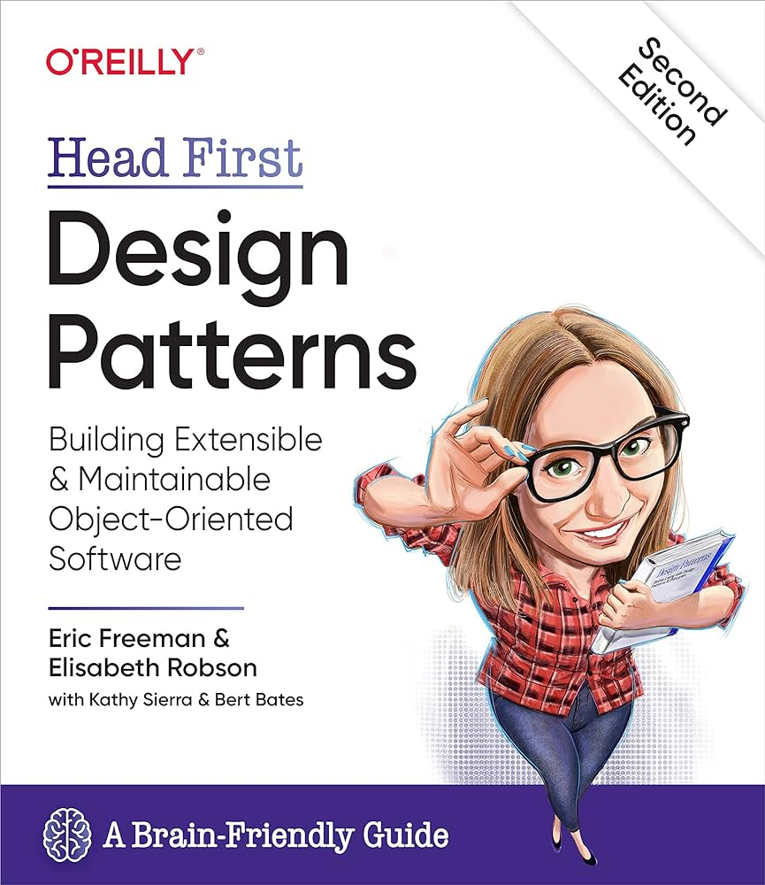

TypeScript implementation of patterns from the Head First Design Patterns (Second Edition) book.

## Usage

- `npm ci`
- `npm run <chapterPattern>` (e.g. `npm run chapter1Strategy`) 

## Patterns

- [Chapter 1: Strategy Pattern](./src/chapter1Strategy)
  - `npm run chapter1Strategy`
- [Chapter 2: Observer Pattern](./src/chapter2Observer)
  - `npm run chapter2Observer`
- [Chapter 3: Decorator Pattern](./src/chapter3Decorator)
  - `npm run chapter3Decorator`
- [Chapter 4: Factory Pattern](./src/chapter4Factory)
  - [Simple Factory](./src/chapter4Factory/simpleFactory/)
    - `npm run chapter4SimpleFactory`
  - [Factory Method](./src/chapter4Factory/factoryMethod/)
    - `npm run chapter4FactoryMethod`
  - [Abstract Factory](./src/chapter4Factory/abstractFactory/)
    - `npm run chapter4AbstractFactory`
- [Singleton Pattern](./src/chapter5Singleton)
  - `npm run chapter5Singleton`
- [Command Pattern](./src/chapter6Command)
  - [Command](./src/chapter6Command/command)
    - `npm run chapter6Command`
  - [Macro Command](./src/chapter6Command/macroCommand)
    - `npm run chapter6MacroCommand`
